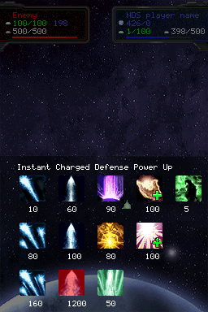

# Meteora Galactic Battle

## Introduction

[Meteora](https://web.archive.org/web/20150118042841/http://meteora.lo2k.net/)
is an arcade game that consists on fighting as a god against another planet.

It scored 3rd place in the NDS Game category in [NEO Summer Coding Compo 2007](https://www.neoflash.com/go/index.php/2007/09/02/the-finally-result-for-this-neo-summer-compo-2007/),
and 2nd place in the Game category in the Dev-fr Coding Compo 2007 (version
0.8.0).

According to the author:

    What is Meteora?

    It is an amateur game for NintendoDS. Coming from more than 8 months of
    development, Meteora is a strategy/action game in space.

    Meteora represents for me the accomplishment of two dreams:

    - Make an entire game from A to Z (including graphics and gameplay).
    - Making an engine that allowed a relatively simple and flexible development
      including, of course, the management of the limited resources of this
      portable console.

    To make you want to check it, meteora:

    - Has an engine containing a garbage collector to avoid memory leaks during
      development.
    - Uses the microphone for certain powers.
    - Uses "gestures"
    - Has visual effects (explosions, tremors, meteorite trails).
    - Uses dual 3D (thanks to ulib).
    - Renders more than 1200 sprites on the screen.

 
 
 

## Build instructions

This game depends on several libraries (PAlib, µLibrary, libpng, zlib and
DSWiFi). The port to BlocksDS has removed the dependency on PAlib, but all other
dependencies remain.

1. Install [BlocksDS](https://blocksds.github.io/docs/).

1. Install [µLibrary](https://github.com/AntonioND/ulibrary):

    ```bash
    wf-pacman -Sy blocksds-ulibrary
    ```

1. Build the game running this in the root of this repository:

    ```bash
    make -j`nproc`
    ```

## Credits

- Original idea, development and GFX:
  Jérôme Wax (aka X-Blaster)
  http://www.lo2k.net

- All "vreemd" sprites are copyrighted by Nintendo

- Original main music by:
  Benoit Charcosset
  http://maf464.free.fr

- Port to BlocksDS by Antonio Niño Díaz
